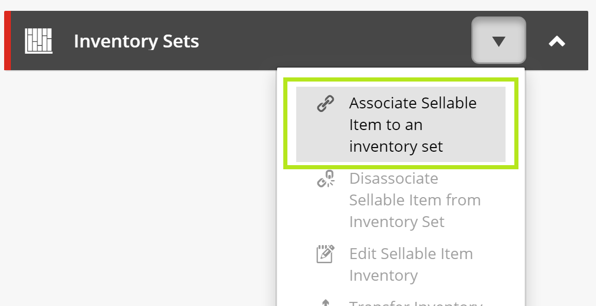
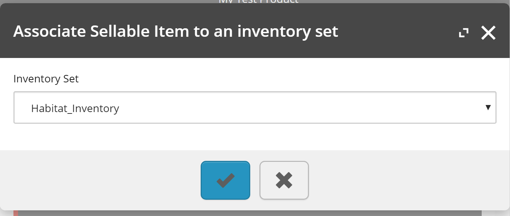
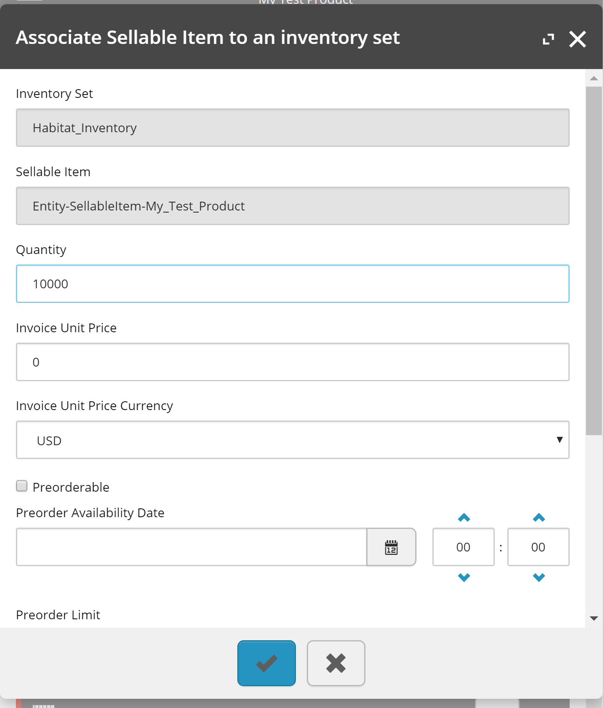

# Extended Sitecore Commerce Inventory
Custom Sitecore Commerce inventory plugin project with extended functionality for the Business Tools.

- [Supported Sitecore Experience Commerce Versions](#supported-sitecore-experience-commerce-versions)
- [Features](#features)
- [Enabling Features](#enabling-features)
- [Enabling Inventory Actions on Published Entities](#enabling-inventory-actions-on-published-entities)
- [Installation Instructions](#installation-instructions)
- [Known Issues](#known-issues)
- [Disclaimer](#disclaimer)

## Supported Sitecore Experience Commerce Versions
- XC 9.2

## Features
- [Associate Inventory from Sellable Item and Variant Page Views](#associate-inventory-from-sellable-item-and-variant-page-views)

### Associate Inventory from Sellable Item and Variant Page Views
Adds action, **Associate Sellable Item to an inventory set** to the **Inventory Sets** entity view, to provide the business user the ability to associate inventory information without requiring navigation to the Inventory Manager. If an inventory information entity already exists when selecting the inventory set, the user will be presented with edit functionality instead.

**Enablement Policy Property:** InventoryFromProductView



_Sellable Item entity view._



_Select Inventory entity view._



_Associate Inventory entity view._

## Enabling Features
In the environment configuration files, add the **CatalogFeatureEnablementPolicy** and set the desired features to `true`. (See the **Enablement Policy Property** value under each feature). For example:
```javascript
{
	"$type": "Ajsuth.Foundation.Inventory.Engine.Policies.InventoryFeatureEnablementPolicy, Ajsuth.Foundation.Inventory.Engine",
	"InventoryFromProductView": true
}
```

## Enabling Inventory Actions on Published Entities
The EntityVersionsActionsPolicy's AllowedActions property allows actions to continue to be enabled to the business user once a versioned entity has been published. To enable inventory actions for sellable item and variant Inventory Sets entity view, add the following action names to the policy.

**Custom Actions**
- "AssociateSellableItemToSelectInventorySet"

**System Actions**

- "DisassociateSellableItemFromInventorySet"
- "EditSellableItemInventory"
- "TransferInventory"

## Installation Instructions
1. Download the repository.
2. Add the **Ajsuth.Foundation.Inventory.Engine.csproj** to the _**Sitecore Commerce Engine**_ solution.
3. In the _**Sitecore Commerce Engine**_ project, add a reference to the **Ajsuth.Foundation.Inventory.Engine** project.
4. Enable desired features, following [Enabling Features](#enabling-features).
5. (Optional) If desired, follow [Enabling Inventory Actions on Published Entities](#enabling-inventory-actions-on-published-entities).
6. Run the _**Sitecore Commerce Engine**_ from Visual Studio or deploy the solution and run from IIS.
7. Run the **Bootstrap** command on the _**Sitecore Commerce Engine**_.

## Known Issues
| Feature                 | Description | Issue |
| ----------------------- | ----------- | ----- |
|                         |             |       |

## Disclaimer
The code provided in this repository is sample code only. It is not intended for production usage and not endorsed by Sitecore.
Both Sitecore and the code author do not take responsibility for any issues caused as a result of using this code.
No guarantee or warranty is provided and code must be used at own risk.
